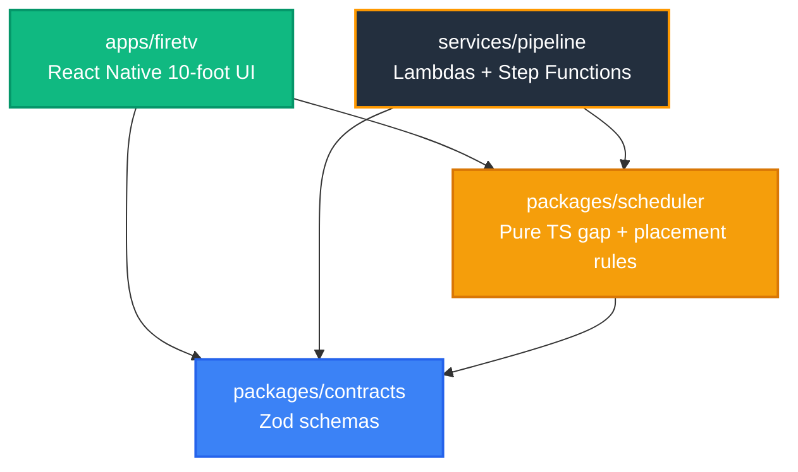

# NarraTV


**▶ [Watch the 2:57 demo](https://youtu.be/J9Vt2vn8tyY)** — the app running on an Android TV device, including the on-screen refusal, extended mode pausing the film for a line that does not fit, and a live Amazon Bedrock Nova Pro description.

**Audio description for the 93% of films that will never get a human one.**

[](./ops/test-all.cmd)
[](./LICENSE)
[](./apps/firetv)
[](./services/pipeline)

> Built for the Amazon **Build, Ship, Shape** Developer Hackathon 2026
> **Track:** Fire TV & Smart TV · **Mini-challenge 1:** AWS Builder · **Mini-challenge 2:** Open Source

---

## The gap, in one screenshot

Open a major streaming app and look at a film's audio menu. Here is a real one — a
2026 Indian feature, playing on a mainstream service:

```
AUDIO                              SUBTITLES
  Tamil                        ✓    Off
  Malayalam        Original         English
  Malayalam        Audio Descr.     English [CC]
  Hindi
  Telugu
  Kannada
```

The film ships in **five languages**. The audio description exists in **one**.

A blind Tamil viewer, on that platform, on that film, gets nothing. Same film,
same app, same evening. That is not an edge case — it is the normal shape of
audio description today.

## Why the gap exists

It is arithmetic, not neglect.

| | |
|---|---|
| Streaming content with any audio description | **~7%** industry-wide |
| Netflix, the coverage leader | **~40%** of its library |
| Cost of human-authored AD | **$15–75 per minute of runtime** |
| A 150-minute film, one language | **$2,250 – $11,250** |
| The same film, five languages | **five times that** |

So the original-language release gets described and the dubs do not. Regional
cinema, back catalogue and independent film never will.

**And the deadline is real.** India's Ministry of Information and Broadcasting
issued OTT accessibility guidelines on **6 February 2026** requiring audio
description, and the Delhi High Court is actively directing CBFC and the Centre
on cinema and OTT accessibility. Platforms are about to need audio description at
a scale description studios cannot staff.

## What NarraTV is

A Fire TV app that **generates the description track when none exists**, on the
viewer's device, per title, per language.

It is not a replacement for a skilled human describer. A human is better. It is
the fallback for everything a human will never be paid to describe.

**Estimated cloud cost for a full 90-minute track: ~$0.37** (breakdown below).
Against $1,350–6,750 for the human equivalent. That ratio is the entire thesis.

---

## What it refuses to do

This is the part worth reading. An audio describer that talks over the film is
worse than no describer at all, so every refusal is enforced in code and shown
on screen.

* **It will not speak over dialogue.** Narration is hard-cancelled the instant a
  dialogue cue starts. Enforced at runtime, covered by a named test.
* **It will not start what it cannot finish.** Before speaking, the scheduler
  measures the room to the next cue *from the moment the voice will actually be
  audible* and refuses outright unless the line fits with 0.4s to spare. The
  refusal is displayed as `SKIPPED · NO GAP`, never silently swallowed.
* **Or, if the viewer asks, it pauses instead of dropping the line.** Extended
  descriptions (off by default; WCAG 2.2 SC 1.2.7) deliver a line that would be
  refused by pausing the film on the exact frame it was written for, speaking it,
  and resuming. It never pauses mid-line, never bypasses a quality gate, and still
  refuses out loud when no safe point exists within 5 s of that frame. On *Sintel*
  it delivers both lines the default mode refuses.
* **It will not pretend to have described a film it hasn't.** Titles with no
  track play normally under an honest `NO AD TRACK` state. The HUD reads
  **AD 10/12** — described gaps over real gaps — not a fabricated 100%.
* **It will not claim AI authorship for text a human wrote.** Every description
  carries a `frameRef` naming the frame it was written from and an honest
  `model` field. A test fails the build if either is missing.
* **It will not block the picture.** Nothing is drawn across the middle of the
  frame; all chrome auto-hides after 4s. A regression test asserts it.

## The hard part is placement, not prose

Anyone can ask a model for a sentence. The engineering is landing it in the
right silence.

* **Real gaps.** `findGaps` merges dialogue intervals and applies 300ms guard
  bands. Sintel's real dialogue starts at **1:47.250**, giving a 107-second
  describable opening and 12 usable gaps across the film.
* **Measured latency, not a guessed constant.** Device TTS is not audible the
  instant you call it. `TtsAdapter` times every utterance from dispatch to first
  audible sample and feeds a rolling average back as the scheduler's lead-in,
  seeded from the class of voice actually selected.
* **Sync you can audit.** The app logs its own error against the video clock:

  ```
  [narratv] AD sintel-ad-07 audible@58.02s target=58.00s error=0.02s
  ```

  Measured across the ten opening descriptions: **mean absolute error 0.20s**.

* **Ducking.** The film bed drops to 25% while a description is audible.

---

## Verified vs. unverified

Stated plainly, because a judge should not have to guess.

| Component | Status | Evidence |
|---|---|---|
| Fire TV UI, D-pad navigation, TalkBack | **Verified** | Android TV emulator, API 30, 1080p |
| Real video streaming | **Verified** | `react-native-video` / ExoPlayer Media3, real `onProgress` timecodes |
| Scheduler invariants (0 overlaps) | **Verified** | Pure TS engine + `fast-check` property tests |
| Narration/dialogue collision refusal | **Verified** | Named runtime tests, on-screen refusal |
| Extended descriptions (WCAG 2.2 SC 1.2.7) | **Verified on the emulator, 2026-09-23** | Off by default. On: the two *Sintel* lines the default mode refuses are delivered by pausing on their own frames, 146.8 s and 449.3 s, zero seconds late. Device run, release APK: logcat `extended pause triggered at 146.65s for sintel-ad-11` → `video paused` → `TTS finished` 5.86 s later → `video resumed` 15 ms after that; [screenshot](docs/assets/screenshots/02e-extended-pause-at-2m26.png) taken mid-pause. Only sintel-ad-11 was watched on the device; sintel-ad-28 is covered by the tests, not yet observed |
| Sync error ≤ ~0.2s mean | **Verified, narrow sample** | App-logged telemetry, `ops-tools/synccheck-inner.cmd`, re-derived from `ops-tools/sync.log` 2026-09-16: **mean absolute error 0.203s** over the **10** lines logged in the opening gap (mean signed −0.081s, median 0.200s, **max 0.540s** on `sintel-ad-02`, 6 of 10 within 0.2s). One run, 2026-09-03. The mean is real; it is 10 of 44 lines from a single pass, not the whole film |
| Honest empty state | **Verified** | *Big Buck Bunny*, *Elephants Dream* play with `NO AD TRACK` |
| Subtitle + description provenance | **Verified** | See the two `PROVENANCE.md` files under `apps/firetv/assets/fixtures/` |
| Bedrock + Polly adapter code | **Verified (mocked)** | `aws-sdk-client-mock`; asserts `amazon.nova-pro-v1:0`, `us-east-1`, fail-loud DEMO enforcement |
| **Live AWS — Polly** | **Verified** | Real `SynthesizeSpeech` call, 2026-09-07: `Joanna`/neural, `us-east-1`, returned a 16,460-byte MP3. `ops-tools/verify-live-aws.cmd` |
| **LIVE mode, in the app's own architecture** | **Deployed — check it yourself** | Live in `us-east-1`: **https://oqxbh0hegf.execute-api.us-east-1.amazonaws.com/health** returns `{"mode":"live","providers":{"bedrock":"ok","polly":"ok","s3":"ok"}}`. `POST /describe` with a real frame returns a Nova Pro description in ~2s. The Fire TV app reaches it by plain `fetch()`, so **no AWS credentials ever go on the television**. `ops/verify-live-endpoint.cmd` and `ops/verify-live-describe-real-frame.cmd` reproduce both |
| **Live AWS — Bedrock** | **Verified** | Real `InvokeModel` on `amazon.nova-pro-v1:0`, `us-east-1`, 2026-09-07: returned `{"output":{"message":{"content":[{"text":"NARRATV LIVE OK"}]...}},"stopReason":"end_turn","usage":{"inputTokens":9,"outputTokens":6}}`. Blocked for ~40 min beforehand by a post-activation account hold — friction-log entry 11. `ops-tools/verify-live-aws.cmd` |
| Description coverage | **Complete** | All **13** dialogue-free gaps carry descriptions: 44 lines, of which 42 play and **2 are refused at runtime** because the gap is shorter than the line takes to speak |
| Model accuracy, measured | **19 of 34 correct unaided** | Every Bedrock-written line was reviewed against its own frame. 19 observations were accepted as written; 15 were corrected. Counts are derived from the per-line labels by `ops-tools/apply-character-register.mjs`, never typed in — see below |
| Character continuity | **Enforced** | One identity per character, held across all 44 lines. `apps/firetv/tests/character-continuity.test.ts` fails the build if the track calls one person two things |
| Refusal visible **in context** | **Verified on device** | `SKIPPED · NO GAP` appears over the picture at 2:26.8, holds 4s, clears. Recorded and frame-checked. Until this fix it never appeared at all — see below |
| Hand-written lines, re-audited | **4 of 10 were wrong** | The opening gap was written by hand and labelled verified, then never re-checked. Re-extracting its frames found four lines describing a scene the film does not contain. Five lines were rewritten in total — the fifth, `ad-05`, was close but led on the wrong detail. Re-derived from the per-line labels 2026-09-16; see `sintel-track.json.PROVENANCE.md` |

### How the track was written, and how good the model actually was

Every line in this track was written from a **picture**, never from a synopsis.
`ops-tools/extract-gap-frames.mjs` pulls frames from the same 888.064-second cut
the app streams, sampled inside each dialogue-free gap;
`ops-tools/author-descriptions.mjs` sends each frame to Nova Pro and stores the
reply verbatim against the timestamp it came from. The model is never told the
title, the plot, or what happens next. If a call fails, the gap stays
undescribed rather than being filled with a guess.

Then a person opened all 34 model-written lines next to their frames. **19
observations were accepted as written; 15 were wrong or loose and were
corrected.** Every corrected entry keeps what the model said in `draftText`
alongside the reason, so the model's unaided accuracy stays auditable instead of
being tidied away:

| frame | Nova Pro wrote | what was wrong |
|---|---|---|
| `06:41` | "A woman holds a spear and **smiles** in a **dark** landscape." | The fog is near-white, not dark. She is plainly not smiling — but the shipped line claims no expression at all rather than swapping one guess for another, because a single still is exactly the wrong evidence for a face |
| `07:29` | "An old man with a beard and **glasses**." | No glasses; he wears an ornate headdress |
| `07:00` | "**Dark** frame with a faint outline of a mountain." | The frame is pale fog |
| `12:12` | "A young woman **walks towards a small dragon**." | The creature is large and lying still; motion inferred from a still image |

### What the live endpoint proved about the model, on the day it went up

Deploying LIVE mode produced a cleaner accuracy measurement than the offline
review did, because it was unplanned.

**First, the endpoint had to be stopped from inventing.** `POST /describe`
treated the frame as optional. Asked about Sintel at 2.0 s — snow blowing across
mountain peaks — with **no image attached**, it answered:

> "Person opens closet door, revealing dark, empty space."
> `confidence: 0.95`, `frameRef: "frame_2.jpg"`

A fluent invention, a high confidence score, and a provenance pointer to an
image that never existed. `frameRef` is the field this project stakes its
honesty on. The handler now refuses outright — `status: skipped`,
`skipReason: no-frame`, confidence 0, and it does not call the model at all —
and three tests hold that line.

**Then, with a real frame, the model was measured twice on the same picture.**
The frame is 00:36: a hooded figure hunched against driving snow, one arm raised
to shield the face, pale ice to the right, whiteout fog.

| Call | Nova Pro said | confidence |
|---|---|---|
| 1 | "Person stands, arms crossed, facing large, glowing blue object." | 0.95 |
| 2 | "Person in brown coat stands, hands clasped, facing ice wall." | 0.95 |

Same image, same temperature, two different answers. Both get the figure. Both
get the posture wrong. **Both miss the blizzard**, which is the dominant feature
of the frame and the one detail a blind viewer most needs. And both report 0.95.

That last column is the finding. **The model's self-reported confidence carries
no information** — 0.95 on an invention with no image, 0.95 on two
non-identical readings of one frame, 0.95 while omitting the snow. Any pipeline
that gates on `confidence >= 0.6` is gating on nothing. This is the strongest
evidence in the project for the human review step, and it arrived by accident
from two curl commands against production.

### One character, one name

A description track can be accurate line by line and still fail the person
listening to it. This one did, for three revisions.

The same protagonist was called "a figure", "she", "a young woman", "the young
woman", "a woman with red hair", "a woman with short red hair" and "a gaunt
woman". Every one of those lines was accurate about its own frame. Together they
were useless: a sighted viewer sees one character walk through a film, and a
listener had no way to tell whether those were one person or seven. The adult
dragon was "a creature", "a large creature" and "a huge dark wing" across five
lines of the same fight.

`v4.0` holds one identity per character — Sintel, the warrior, the small dragon,
the shaman, the dragon — each introduced once by what is visible, then never
renamed. Her name is withheld until **96 s**, where the film puts SINTEL on
screen, so the description never hands a blind viewer something a sighted viewer
does not yet have. An earlier attempt withheld it until 457.8 s, the first time
dialogue speaks it; that bought a reveal nobody wanted at the cost of seven
minutes of drift, and was reverted.

Two guards keep it: `ops-tools/apply-character-register.mjs` refuses to write the
track if a banned referent survives or the name appears too early, and
`character-continuity.test.ts` asserts the same invariants in CI.

### The refusal nobody could see

The two refused lines were refused correctly and reported honestly in two
places — the counter pill read `2 SKIPPED`, the timeline card read
`SKIPPED: NO-GAP` with the reason — and in the one place that matters, a viewer
watching the film straight through, **nothing happened at all.**

The cause is a seam between two layers. For a pre-placed track the repository
resolves collisions at *load* time and stamps `status: 'skipped'`. The
scheduler's candidate search then filters skipped entries out, so its runtime
refusal branch could never fire for them. Both layers were right on their own
and the feature fell down the gap between them.

That is the worst possible shape for this defect, because a refusal that looks
exactly like silence is not a refusal — it is the thing this project exists to
argue against. The scheduler now surfaces a pre-refused line at the moment it
would have spoken, holds the notice for 4 seconds of film time and takes it
down. Three tests in `use-scheduler.test.ts` cover it, including one asserting
that refusing still never licenses speaking.

Verified on the device, not just in tests: at 2:26.8 `SKIPPED · NO GAP` is on
the picture, and by 2:32 it is gone.

### The audit that found our own work wrong

The first review checked all 34 Bedrock lines. It did **not** re-check the ten
hand-written lines in the opening gap, because those were already labelled
`human-verified-frames`.

Re-extracting those frames found **four of the ten describing a scene that is
not in the film.** The track said she wades alone through drifts past a stone
structure, stops with a spear behind her, then lies face down while an old man
in worn robes takes her hand. The frames show a fight: a bald warrior in dark
leathers drives her backwards, they square off across the slope, and he bears
down on her with her own spear between them. No old man. No stone structure.
She is on her feet.

Sintel opens on the fight that starts its story, and this track described it as
a quiet walk. That is the same failure the fabricated `v1` was thrown out for,
and it survived two revisions because a provenance label was treated as
evidence. **A label is a claim about process, not a certificate of accuracy —
only the frame settles it.** All four are rewritten, each carrying its previous
wording and the reason.

The pattern across both audits is consistent and worth stating plainly: the model is reliable on
**what is in frame** and unreliable on **expression and motion**, which a single
still cannot carry. For audio description that distinction matters more than
raw accuracy — telling a blind viewer that a snarling character is smiling is
worse than saying nothing. That is the argument for keeping a human review step
in the pipeline rather than shipping raw model output, and it is why
`services/pipeline/src/local/review-cli.ts` exists.

This discipline was learned the hard way. An earlier revision shipped 28
descriptions and a 26-cue subtitle file that were **invented** — a plot summary
with fabricated timestamps, over dialogue that does not occur in the film. It
was caught by pulling frames and comparing. Both files were replaced: the
subtitles now come verbatim from the official Wikimedia Commons track.

Evidence images: [`docs/assets/evidence/`](./docs/assets/evidence/).

---

## Architecture

Dependencies point inward toward the domain.



* [`packages/contracts`](./packages/contracts) — Zod validators and types.
* [`packages/scheduler`](./packages/scheduler) — deterministic timing engine:
  `findGaps` (300ms guards), `placeDescriptions` (speech-rate budgeting), counters.
* [`apps/firetv`](./apps/firetv) — 10-foot UI, D-pad navigation, auto-hiding chrome, TalkBack.
* [`services/pipeline`](./services/pipeline) — CDK v2, Lambdas, Step Functions,
  and `LiveDescribeAdapter` for Bedrock Nova Pro + Polly Neural.

## Estimated cloud cost, per 90-minute film

| Resource | Workload | Pricing | Cost |
|---|---|---|---|
| Bedrock (Nova Pro) | ~180 gaps × 850 in / 35 out tokens | $0.0008/1K in, $0.0032/1K out | $0.142 |
| Polly (Neural) | ~180 descriptions × 75 chars | $16.00 / 1M chars | $0.216 |
| Lambda | ~720 invocations | $0.0000083 / GB-s | $0.008 |
| Step Functions | ~180 transitions | $0.025 / 1K | $0.005 |
| S3 + CloudFront | 180 audio + 180 frames | standard | $0.003 |
| **Total** | | | **~$0.37** |

Calculated from published AWS rates ([`docs/02-product/sources.md`](./docs/02-product/sources.md)),
**projected, not billed**. The live usage that actually happened is smaller and
of a different shape: the Nova Pro calls that authored this track, plus the
`/describe` calls from the device. We have not reconciled a bill against the
projection and do not claim to have.

This is **cloud cost only**. Given that 15 of 34 model observations needed
correcting, a production deployment must budget human review on top — and on the
evidence here that review is not optional.

## Running it

```powershell
ops\test-all.cmd          # 34 suites / 172 tests across 4 workspaces (builds the shared packages first)
ops\build-release.cmd     # signed release APK for Fire OS / Android TV
ops\test.cmd              # app suites only
npm run typecheck         # tsc --noEmit over all 4 workspaces
```

The typecheck matters and is not decoration. Jest runs through babel, which
strips TypeScript types without checking them, so this suite stayed green for
weeks while `tsc --noEmit` failed with seven errors — two of them real defects
on the catalog screen and the audio-description playback path. There is now a
test that runs the root typecheck and fails the suite if it regresses
(`services/pipeline/tests/typecheck.test.ts`), which is why the count above
includes it.

A step-by-step guide for running and verifying this project, written for
someone who has never seen the repo, is in
[`docs/06-demo-submission/walkthrough.md`](./docs/06-demo-submission/walkthrough.md).

`NODE_ENV` is pinned to `test` inside those scripts on purpose — see the comment
in [`ops/test.cmd`](./ops/test.cmd).

Emulator and capture helpers live in `ops-tools/` (outside the repo): emulator
prep, OBS recording with audio, take verification, and the sync-error harness.

### Which Fire TV platform this targets, and why

Fire TV has two platforms — **Fire OS**, which is Android-based, and **Vega
OS**, which runs React Native on Amazon's own runtime. This app targets Fire OS,
built with `react-native-tvos` and Expo, and runs on an Android TV device or
emulator (API 30+).

That is a deliberate choice rather than a limitation: the Vega toolchain
requires a Linux or macOS host, and this project was built on Windows. Amazon's
developer-relations team confirmed on the hackathon's official build session
that Fire OS entries are fully eligible and that a virtual device is an accepted
demo target — their own live demo ran on one. The domain and scheduler packages
are plain TypeScript with no platform imports, so a Vega build would reuse them
unchanged; only the player shell is platform-specific.

## Licensing

* **Software** — [MIT](./LICENSE), © 2026 Atchayam G.
* **Media** — Creative Commons Attribution works from the Blender Foundation:
  * *Sintel* — © Blender Foundation, [durian.blender.org](https://durian.blender.org), CC-BY 3.0
  * *Big Buck Bunny* — © 2008 Blender Foundation, [peach.blender.org](https://peach.blender.org), CC-BY 3.0
  * *Elephants Dream* — © 2006 Blender Foundation / Netherlands Media Art Institute, [orange.blender.org](https://orange.blender.org), CC-BY 2.5
* **Sintel subtitles** — official English track from Wikimedia Commons
  (`TimedText:Sintel_movie_4K.webm.en.srt`), CC-BY 3.0. Attribution is shown
  in-app on the System Status screen.

Records: [`docs/06-demo-submission/media-licenses.md`](./docs/06-demo-submission/media-licenses.md).

## Sources

* Audio description coverage — [TestParty media accessibility statistics](https://testparty.ai/blog/media-accessibility-statistics)
* AD production cost — [3Play Media](https://www.3playmedia.com/blog/how-much-does-audio-description-cost/)
* India OTT accessibility guidelines & Delhi HC — [MediaNama, Aug 2026](https://www.medianama.com/2026/08/223-delhi-hc-cbfc-ott-differently-abled/)
* CBFC draft accessibility guidelines — [cbfcindia.gov.in (PDF)](https://www.cbfcindia.gov.in/cbfcAdmin/assets/pdf/Final_Draft_Accessibility_Guidelines_Films.pdf)
