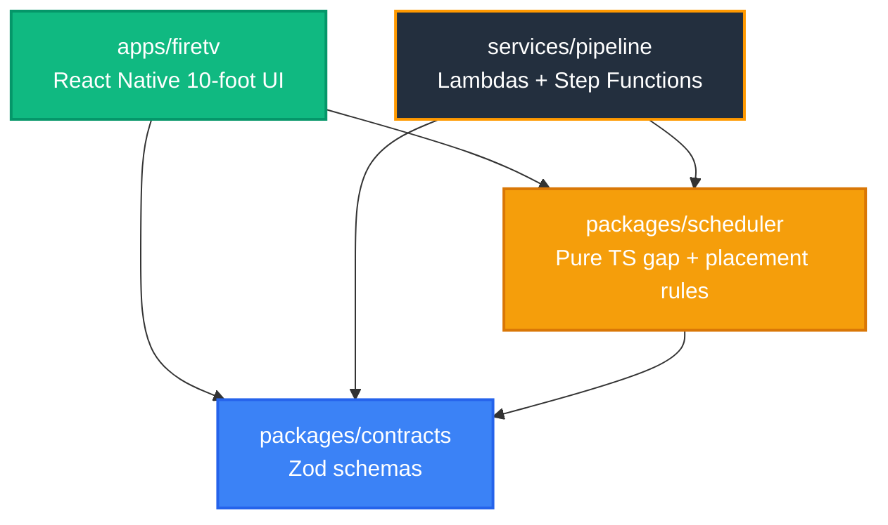

# NarraTV

**Audio description for the 93% of films that will never get a human one.**

[](./ops/test-all.cmd)
[](./LICENSE)
[](./apps/firetv)
[](./services/pipeline)

> Built for the Amazon **Build, Ship, Shape** Developer Hackathon 2026
> **Track:** Fire TV & Smart TV · **Mini-challenge 1:** AWS Builder · **Mini-challenge 2:** Open Source

---

## The gap, in one screenshot

Open a major streaming app and look at a film's audio menu. Here is a real one — a
2026 Indian feature, playing on a mainstream service:

```
AUDIO                              SUBTITLES
  Tamil                        ✓    Off
  Malayalam        Original         English
  Malayalam        Audio Descr.     English [CC]
  Hindi
  Telugu
  Kannada
```

The film ships in **five languages**. The audio description exists in **one**.

A blind Tamil viewer, on that platform, on that film, gets nothing. Same film,
same app, same evening. That is not an edge case — it is the normal shape of
audio description today.

## Why the gap exists

It is arithmetic, not neglect.

| | |
|---|---|
| Streaming content with any audio description | **~7%** industry-wide |
| Netflix, the coverage leader | **~40%** of its library |
| Cost of human-authored AD | **$15–75 per minute of runtime** |
| A 150-minute film, one language | **$2,250 – $11,250** |
| The same film, five languages | **five times that** |

So the original-language release gets described and the dubs do not. Regional
cinema, back catalogue and independent film never will.

**And the deadline is real.** India's Ministry of Information and Broadcasting
issued OTT accessibility guidelines on **6 February 2026** requiring audio
description, and the Delhi High Court is actively directing CBFC and the Centre
on cinema and OTT accessibility. Platforms are about to need audio description at
a scale description studios cannot staff.

## What NarraTV is

A Fire TV app that **generates the description track when none exists**, on the
viewer's device, per title, per language.

It is not a replacement for a skilled human describer. A human is better. It is
the fallback for everything a human will never be paid to describe.

**Estimated cloud cost for a full 90-minute track: ~$0.37** (breakdown below).
Against $1,350–6,750 for the human equivalent. That ratio is the entire thesis.

---

## What it refuses to do

This is the part worth reading. An audio describer that talks over the film is
worse than no describer at all, so every refusal is enforced in code and shown
on screen.

* **It will not speak over dialogue.** Narration is hard-cancelled the instant a
  dialogue cue starts. Enforced at runtime, covered by a named test.
* **It will not start what it cannot finish.** Before speaking, the scheduler
  measures the room to the next cue *from the moment the voice will actually be
  audible* and refuses outright unless the line fits with 0.4s to spare. The
  refusal is displayed as `SKIPPED · NO GAP`, never silently swallowed.
* **It will not pretend to have described a film it hasn't.** Titles with no
  track play normally under an honest `NO AD TRACK` state. The HUD reads
  **AD 10/12** — described gaps over real gaps — not a fabricated 100%.
* **It will not claim AI authorship for text a human wrote.** Every description
  carries a `frameRef` naming the frame it was written from and an honest
  `model` field. A test fails the build if either is missing.
* **It will not block the picture.** Nothing is drawn across the middle of the
  frame; all chrome auto-hides after 4s. A regression test asserts it.

## The hard part is placement, not prose

Anyone can ask a model for a sentence. The engineering is landing it in the
right silence.

* **Real gaps.** `findGaps` merges dialogue intervals and applies 300ms guard
  bands. Sintel's real dialogue starts at **1:47.250**, giving a 107-second
  describable opening and 12 usable gaps across the film.
* **Measured latency, not a guessed constant.** Device TTS is not audible the
  instant you call it. `TtsAdapter` times every utterance from dispatch to first
  audible sample and feeds a rolling average back as the scheduler's lead-in,
  seeded from the class of voice actually selected.
* **Sync you can audit.** The app logs its own error against the video clock:

  ```
  [narratv] AD sintel-ad-07 audible@58.02s target=58.00s error=0.02s
  ```

  Measured across the ten opening descriptions: **mean absolute error 0.20s**.

* **Ducking.** The film bed drops to 25% while a description is audible.

---

## Verified vs. unverified

Stated plainly, because a judge should not have to guess.

| Component | Status | Evidence |
|---|---|---|
| Fire TV UI, D-pad navigation, TalkBack | **Verified** | Android TV emulator, API 30, 1080p |
| Real video streaming | **Verified** | `react-native-video` / ExoPlayer Media3, real `onProgress` timecodes |
| Scheduler invariants (0 overlaps) | **Verified** | Pure TS engine + `fast-check` property tests |
| Narration/dialogue collision refusal | **Verified** | Named runtime tests, on-screen refusal |
| Sync error ≤ ~0.2s mean | **Verified** | App-logged telemetry, `ops-tools/synccheck-inner.cmd` |
| Honest empty state | **Verified** | *Big Buck Bunny*, *Elephants Dream* play with `NO AD TRACK` |
| Subtitle + description provenance | **Verified** | See the two `PROVENANCE.md` files under `apps/firetv/assets/fixtures/` |
| Bedrock + Polly adapter code | **Verified (mocked)** | `aws-sdk-client-mock`; asserts `amazon.nova-pro-v1:0`, `us-east-1`, fail-loud DEMO enforcement |
| **Live AWS end-to-end** | **Unverified — blocked upstream** | The AWS account is on the Free account plan, which gates IAM, Bedrock and CloudShell behind a "Complete your account setup" redirect and cannot redeem the hackathon promotional credit. AWS Support case 178846263500398 (opened 2026-09-03) is still unanswered. Nothing in this repository is waiting on code. Runbook: [`live-mode-runbook.md`](./docs/03-architecture/live-mode-runbook.md); the full write-up is friction-log entry 9 |
| Description coverage | **Partial, by design** | Only gap 0 (0–106.95s) is described. Gaps 1–11 await Bedrock authoring — see below |

### Why only one gap is described

The description track shipped here covers the film's opening 107 seconds and no
more. That is deliberate.

An earlier revision of this repository shipped 28 descriptions and a 26-cue
subtitle file that were **invented** — a plot summary with fabricated
timestamps, over dialogue that does not occur in the film. It was caught by
pulling frames from the real stream and comparing. Both files were replaced:
the subtitles now come verbatim from the official Wikimedia Commons track, and
every remaining description was written by looking at the frame it names.

Filling gaps 1–11 honestly means authoring against frames, which is exactly what
LIVE mode exists to do. Generating them offline from a synopsis is the failure
that was removed. The counters are lower and true.

Evidence images: [`docs/assets/evidence/`](./docs/assets/evidence/).

---

## Architecture

Dependencies point inward toward the domain.



* [`packages/contracts`](./packages/contracts) — Zod validators and types.
* [`packages/scheduler`](./packages/scheduler) — deterministic timing engine:
  `findGaps` (300ms guards), `placeDescriptions` (speech-rate budgeting), counters.
* [`apps/firetv`](./apps/firetv) — 10-foot UI, D-pad navigation, auto-hiding chrome, TalkBack.
* [`services/pipeline`](./services/pipeline) — CDK v2, Lambdas, Step Functions,
  and `LiveDescribeAdapter` for Bedrock Nova Pro + Polly Neural.

## Estimated cloud cost, per 90-minute film

| Resource | Workload | Pricing | Cost |
|---|---|---|---|
| Bedrock (Nova Pro) | ~180 gaps × 850 in / 35 out tokens | $0.0008/1K in, $0.0032/1K out | $0.142 |
| Polly (Neural) | ~180 descriptions × 75 chars | $16.00 / 1M chars | $0.216 |
| Lambda | ~720 invocations | $0.0000083 / GB-s | $0.008 |
| Step Functions | ~180 transitions | $0.025 / 1K | $0.005 |
| S3 + CloudFront | 180 audio + 180 frames | standard | $0.003 |
| **Total** | | | **~$0.37** |

Calculated from published AWS rates ([`docs/02-product/sources.md`](./docs/02-product/sources.md)),
not measured — live execution is still pending. This is **cloud cost only**; a
production deployment should budget human QA review on top, and we would not
claim otherwise.

## Running it

```powershell
ops\test-all.cmd          # 22 suites / 87 tests across 4 workspaces
ops\build-release.cmd     # signed release APK for Fire OS / Android TV
ops\test.cmd              # app suites only
```

`NODE_ENV` is pinned to `test` inside those scripts on purpose — see the comment
in [`ops/test.cmd`](./ops/test.cmd).

Emulator and capture helpers live in `ops-tools/` (outside the repo): emulator
prep, OBS recording with audio, take verification, and the sync-error harness.

### Which Fire TV platform this targets, and why

Fire TV has two platforms — **Fire OS**, which is Android-based, and **Vega
OS**, which runs React Native on Amazon's own runtime. This app targets Fire OS,
built with `react-native-tvos` and Expo, and runs on an Android TV device or
emulator (API 30+).

That is a deliberate choice rather than a limitation: the Vega toolchain
requires a Linux or macOS host, and this project was built on Windows. Amazon's
developer-relations team confirmed on the hackathon's official build session
that Fire OS entries are fully eligible and that a virtual device is an accepted
demo target — their own live demo ran on one. The domain and scheduler packages
are plain TypeScript with no platform imports, so a Vega build would reuse them
unchanged; only the player shell is platform-specific.

## Licensing

* **Software** — [MIT](./LICENSE), © 2026 Atchayam G.
* **Media** — Creative Commons Attribution works from the Blender Foundation:
  * *Sintel* — © Blender Foundation, [durian.blender.org](https://durian.blender.org), CC-BY 3.0
  * *Big Buck Bunny* — © 2008 Blender Foundation, [peach.blender.org](https://peach.blender.org), CC-BY 3.0
  * *Elephants Dream* — © 2006 Blender Foundation / Netherlands Media Art Institute, [orange.blender.org](https://orange.blender.org), CC-BY 2.5
* **Sintel subtitles** — official English track from Wikimedia Commons
  (`TimedText:Sintel_movie_4K.webm.en.srt`), CC-BY 3.0. Attribution is shown
  in-app on the System Status screen.

Records: [`docs/06-demo-submission/media-licenses.md`](./docs/06-demo-submission/media-licenses.md).

## Sources

* Audio description coverage — [TestParty media accessibility statistics](https://testparty.ai/blog/media-accessibility-statistics)
* AD production cost — [3Play Media](https://www.3playmedia.com/blog/how-much-does-audio-description-cost/)
* India OTT accessibility guidelines & Delhi HC — [MediaNama, Aug 2026](https://www.medianama.com/2026/08/223-delhi-hc-cbfc-ott-differently-abled/)
* CBFC draft accessibility guidelines — [cbfcindia.gov.in (PDF)](https://www.cbfcindia.gov.in/cbfcAdmin/assets/pdf/Final_Draft_Accessibility_Guidelines_Films.pdf)
