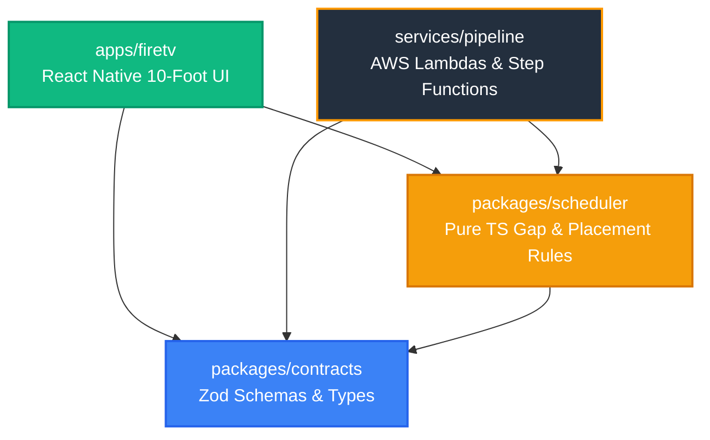

# NarraTV: Intelligent Scene Audio Description for Amazon Fire TV

[-success)](./ops/sync-and-test.cmd)
[](./LICENSE)
[-orange)](./apps/firetv)
[](./services/pipeline)
[](./docs/03-architecture/architecture.md)

> **Built for the Amazon "Build, Ship, Shape" Developer Hackathon 2026**
> * **Primary Track**: Fire TV & Smart TV Experience
> * **Mini-Challenge 1**: AWS Builder (Amazon Bedrock Nova Pro + Amazon Polly Neural + AWS Step Functions + CDK v2)
> * **Mini-Challenge 2**: Open Source (100% MIT Licensed, CC-BY open cinema, offline deterministic engine)

---

## 🌟 The Problem & Solution

* **The Problem**: According to the World Health Organization (WHO), at least **2.2 billion people** globally live with vision impairment. While dialogue subtitles are widely standard, Audio Description (AD)—spoken narration describing visual actions, facial expressions, and scene changes—remains scarce across streaming and independent cinema.
* **The Solution**: **NarraTV** is an automated, multimodal scene description pipeline and 10-foot Fire TV application. By uniting **Amazon Bedrock Nova Pro multimodal AI** with a **mathematically deterministic gap-placement scheduler**, NarraTV synthesizes and schedules vivid present-tense scene descriptions exclusively during dialogue-free moments—**guaranteeing 0 dialogue collisions** at an estimated AWS cost of ~$0.37 per 90-minute film.

---

## 🎬 Shipped Fire TV Experience

| Catalog Screen (Cinematic Obsidian & Amber) | Real Video Playback with Active Scene Narration |
|:---:|:---:|
| Hero spotlight, D-pad spatial navigation, TalkBack announcements | Synchronized speech, SRT dialogue protection, unclipped controls |

```
┌────────────────────────────────────────────────────────────────────────────┐
│  [NarraTV]                                              [● DEMO MODE]      │
│                                                                            │
│   SINTEL (2010) · 15m · CC-BY 3.0 · Fantasy / Animation                    │
│  ┌──────────────────────────────────────────────────────────────────────┐  │
│  │                                                                      │  │
│  │  [  REAL VIDEO PLAYER: Sintel stands atop blizzard-swept peak  ]     │  │
│  │                                                                      │  │
│  └──────────────────────────────────────────────────────────────────────┘  │
│                                                                            │
│   TIMELINE SURFACE (Press MENU to inspect placement invariants):           │
│  [■■■ Dialogue ■■■] ─── [● AD: "A solitary figure trudges..."] ─── [■■■]   │
│                                                                            │
│   Counters: 15 Gaps | 13 Described | 2 Skipped (no-gap) | 0 Overlaps       │
└────────────────────────────────────────────────────────────────────────────┘
```

---

## ⚖️ Verified Reality vs. Unverified Status

In adherence to hackathon integrity rules, NarraTV explicitly reports what has been verified versus what remains unverified pending cloud account activation:

| Component | Status | Verification Evidence |
|---|---|---|
| **Fire TV App UI & Remote D-Pad Navigation** | **VERIFIED** | Tested on Android TV emulator (API 30, 1080p, host GPU). D-pad Euclidean navigation, TalkBack screen reader support. |
| **Real Video Streaming Engine** | **VERIFIED** | `react-native-video` (ExoPlayer Media3) decodes and streams real H.264 video with millisecond-accurate `onProgress` timecodes. |
| **Mathematical Scheduler (0 Overlaps)** | **VERIFIED** | Pure TypeScript domain engine tested via 100-run `fast-check` generative property tests (`fast-check`) proving 0 collisions. |
| **Offline Demo Mode (`DEMO_MODE=true`)** | **VERIFIED** | Bundled open movie fixtures (*Sintel*) play offline with real local TTS fallback (`expo-speech` / Android TTS). |
| **Honest Non-Generated Track State** | **VERIFIED** | Titles without pre-generated tracks (*Big Buck Bunny*, *Elephants Dream*) stream normally while displaying honest `NO AD TRACK` state. |
| **Transparency Surfaces** | **VERIFIED** | `TruthPill` indicator, `TimelineSurface` drawer, and `WhyPanel` refusal inspector. |
| **In-App CC-BY Attribution** | **VERIFIED** | System Status screen prominently displays Blender Foundation Creative Commons licenses. |
| **Live Bedrock & Polly Adapter Code** | **VERIFIED (Mocked)** | Tested via `aws-sdk-client-mock`. Verifies model `amazon.nova-pro-v1:0`, `us-east-1`, frame bytes, and fail-loud DEMO enforcement. |
| **Live AWS End-to-End Execution** | **UNVERIFIED** | As disclosed during submission, the AWS account was undergoing activation. Live cloud calls are documented in [`docs/03-architecture/live-mode-runbook.md`](./docs/03-architecture/live-mode-runbook.md) and remain unverified until executed with live credentials. |

---

## 🛠 Orchestrator Run & Build Scripts (Windows)

All build and testing operations are standardized through the orchestrator scripts in `ops\`:

```powershell
# 1. Clean monorepo sync & test execution across all 4 workspaces (100% green)
ops\sync-and-test.cmd

# 2. Compile standalone signed release APK for Fire OS / Android TV
ops\build-release.cmd

# 3. Enable Google TTS accessibility engine on emulator (ships disabled on AVD images)
ops\fix-tts.cmd

# 4. Clean install APK and capture verification screenshots
ops\install-and-shoot.cmd

# 5. Diagnostic recovery scripts if ADB or emulator hangs
ops\adb-reset.cmd
ops\restart-emulator.cmd
```

---

## 🏛 Clean Architecture Monorepo

NarraTV enforces Uncle Bob's **Clean Architecture Dependency Rule**: source code dependencies point strictly inward toward domain business rules.



### Workspaces
* [`packages/contracts`](./packages/contracts): Zod runtime validators and TypeScript types for `Title`, `SubtitleCue`, `Gap`, `Description`, `DescriptionTrack`, and `HealthResponse`.
* [`packages/scheduler`](./packages/scheduler): Pure TypeScript deterministic timing engine. Implements `findGaps` with 300ms guard bands, `placeDescriptions` with speech-rate budgeting, and mathematical invariant counters.
* [`apps/firetv`](./apps/firetv): React Native 10-foot television application with D-pad navigation, high-contrast theme, safe-area inset controls, and TalkBack accessibility.
* [`services/pipeline`](./services/pipeline): AWS CDK v2 cloud infrastructure, Lambda handlers, Step Functions state machine, and the `LiveDescribeAdapter` for Amazon Bedrock Nova Pro and Polly Neural.

---

## 💰 Production Cost Model (Calculated per 90-Minute Film)

| Cloud Resource | Workload per 90-min Film | Pricing Model | Estimated Cost |
|---|---|---|---|
| **Amazon Bedrock (Nova Pro)** | ~180 gaps × 850 in / 35 out tokens | $0.0008 / 1K in, $0.0032 / 1K out | **$0.142 USD** |
| **Amazon Polly (Neural)** | ~180 descriptions × 75 characters | $16.00 / 1M characters | **$0.216 USD** |
| **AWS Lambda** | ~720 invocations (Node.js 22.x) | $0.0000083 / GB-s | **$0.008 USD** |
| **AWS Step Functions** | ~180 state transitions | $0.025 / 1K transitions | **$0.005 USD** |
| **Amazon S3 & CloudFront** | 180 audio files + 180 video frames | Standard storage & egress | **$0.003 USD** |
| **TOTAL ESTIMATED AWS COST** | **Complete Feature Film AD Track** | **Turnkey Automated Cost** | **~$0.37 USD** |

*All cost references represent calculated AWS cloud resource expenditures documented in [`docs/02-product/sources.md`](./docs/02-product/sources.md).*

---

## 📜 Open Source & Media Licensing

* **Software**: Distributed under the [MIT License](./LICENSE) (Copyright © 2026 Atchayam G).
* **Open Movie Media**: All video streams, subtitles, and extracted artwork are Creative Commons Attribution works from the **Blender Foundation**:
  * *Sintel* (© copyright Blender Foundation | [durian.blender.org](https://durian.blender.org) | CC-BY 3.0)
  * *Big Buck Bunny* (© copyright 2008, Blender Foundation / [www.bigbuckbunny.org](https://peach.blender.org) | CC-BY 3.0)
  * *Elephants Dream* (© copyright 2006, Blender Foundation / Netherlands Media Art Institute / [www.elephantsdream.org](https://orange.blender.org) | CC-BY 2.5)
* Full licensing records and verification URLs are maintained in [`docs/06-demo-submission/media-licenses.md`](./docs/06-demo-submission/media-licenses.md).
